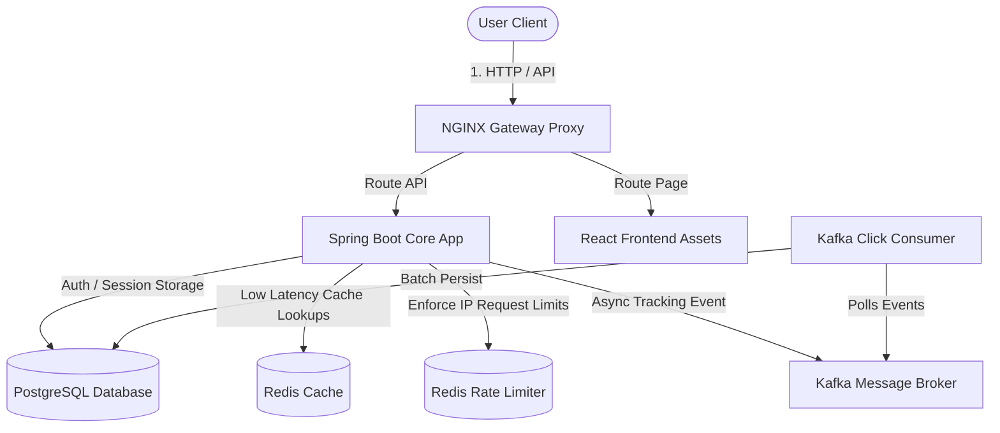

# System Architecture

This document provides a breakdown of the architectural concepts, data flow, and design patterns utilized in TrimURL.

---

## Architecture Blueprint

For more detailed diagrams, refer to the following documents:
- [System Overview](file:///c:/Users/mittu/Url%20Shortner/docs/architecture/system-overview.md): Context boundaries.
- [High Level Design (HLD)](file:///c:/Users/mittu/Url%20Shortner/docs/architecture/hld.md): Sequence diagrams for redirections and event logging pipelines.
- [Low Level Design (LLD)](file:///c:/Users/mittu/Url%20Shortner/docs/architecture/lld.md): Base62 arithmetic details and Lua rate limiting scripts.
- [Deployment Architecture](file:///c:/Users/mittu/Url%20Shortner/docs/architecture/deployment.md): AWS multi-AZ VPC mapping details.

---

## Decoupled Event Analytics

Redirections must complete in **<50ms**. Writing click statistics (country, browser, device, timestamp) directly to the database synchronously on every request blocks the thread and increases DB connection pooling bottlenecks.

TrimURL implements a **decoupled asynchronous ingestion queue**:
1. When a client visits `/{shortCode}`, TrimURL checks Redis first (average response time **<5ms**).
2. The controller sends a redirect request (302 Found) back to the user.
3. Simultaneously, it fires a lightweight event message to a Kafka topic (`url-clicks`).
4. An out-of-band Kafka consumer group polls these messages, batches them, and writes them to PostgreSQL, keeping user redirect latency completely unaffected.
