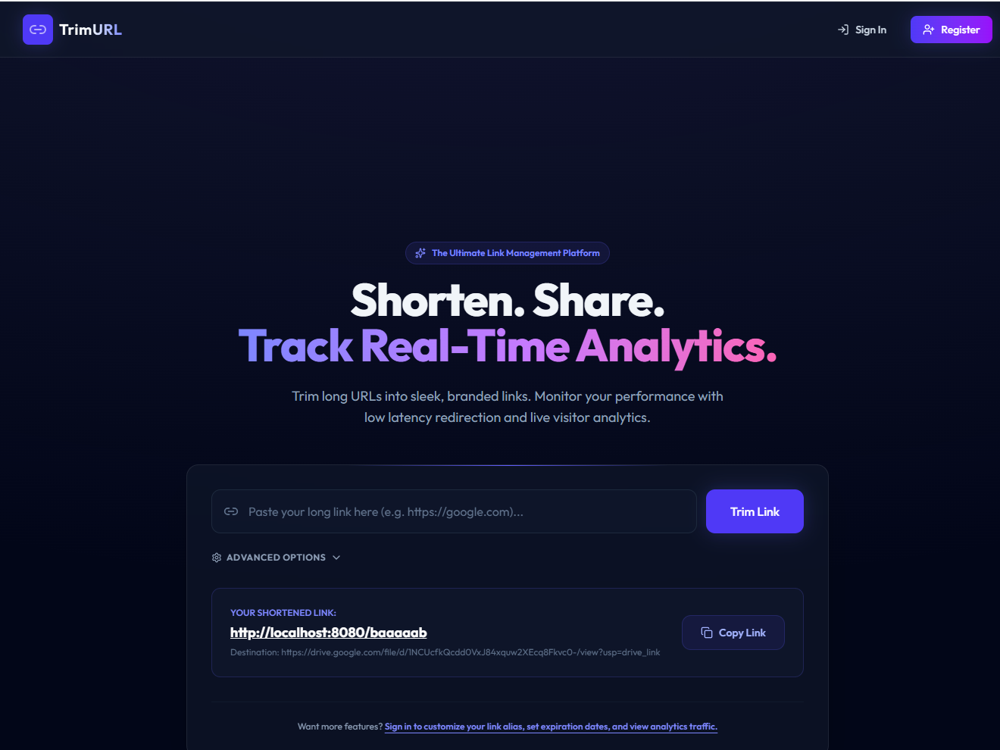

# TrimURL - Distributed URL Shortener (Bitly/TinyURL Clone)

TrimURL is a production-grade, high-performance distributed URL shortening platform built using Spring Boot, PostgreSQL, Redis, Kafka, and React. It is optimized for low-latency redirections (<50ms) and handles real-time visitor analytics asynchronously.

---

## Screenshots

### Landing Page



### Shortened Link Preview


---

## High Level Features Checklist

- [x] **Spring Boot Microservice**: Clean REST APIs utilizing Java 21, JPA, Maven.
- [x] **PostgreSQL**: Stores relational models for Users, URLs, API keys, and Analytics events.
- [x] **Redis Cache**: Low-latency lookup for short code mapping (`short_code -> long_url`).
- [x] **Kafka Analytics**: Asynchronous event streaming to collect click info out-of-band.
- [x] **JWT Authentication**: Secure stateless session endpoints (`/auth/*`).
- [x] **Rate Limiting**: Redis Token Bucket algorithm restricting client traffic to 100 req/min/IP.
- [x] **Base62 Encoding**: Thread-safe, deterministic, collision-free code generator using unique DB sequence values.
- [x] **Docker Compose**: Orchestrates PostgreSQL, Redis, Kafka, Zookeeper, Nginx, Prometheus, Grafana, and the apps.
- [x] **Observability**: Prometheus scraping Actuator metrics and pre-configured Grafana boards.
- [x] **Load Testing**: k6 performance test script targeting redirections.

---

## Directory Structure

```text
TrimURL/
├── docker-compose.yml        # Multi-container local execution setup
├── docs/
│   └── architecture/        # HLD, LLD, Context, and Deployment diagrams
├── backend/                  # Spring Boot backend app
│   ├── src/main/java        # Main codebase
│   └── src/test/java        # Unit and Integration test suite
├── frontend/                 # React SPA + TypeScript + Vite + Tailwind CSS
│   ├── src/pages/           # App routes (Landing, Dashboard, Login, Register)
│   └── src/services/        # API communications client
├── monitoring/               # Scrape targets and visualization configurations
└── tests/                    # Load testing scenarios using k6
```

---

## Setup & Running Locally

### Prerequisites

- Docker & Docker Compose
- Java 22 / 21 SDK (for compiling backend code outside containers)
- Node.js v20+

### 1. Launching via Docker Compose

From the project root directory, run:

```bash
docker-compose up -d --build
```

This builds and boots all dependencies:

- **Frontend App**: Available on [http://localhost](http://localhost) (mapped to Nginx port 80).
- **Backend App**: Internal routing on port 8080.
- **Grafana Metrics Dashboard**: Available on [http://localhost:3000](http://localhost:3000) (User: `admin`, Pass: `admin`).
- **Prometheus Scraper**: Available on [http://localhost:9090](http://localhost:9090).

### 2. Manual Development Run

If you want to run backend and frontend independently outside Docker:

**Start Database, Redis & Kafka in Docker:**

```bash
docker-compose up -d postgres redis kafka zookeeper
```

**Run Backend (Spring Boot):**

```bash
cd backend
../.maven/apache-maven-3.9.6/bin/mvn spring-boot:run
```

**Run Frontend (React SPA):**

```bash
cd frontend
npm install
npm run dev
```

---

## Running Test Suites

### Unit & Integration Tests

Run JUnit tests to verify encoder determinism, caching logic, and protocol blocklists:

```bash
cd backend
../.maven/apache-maven-3.9.6/bin/mvn clean test
```

### Redirection Load Testing

Verify throughput and p95 latency (<50ms) using k6:

```bash
k6 run tests/load-test.js
```
