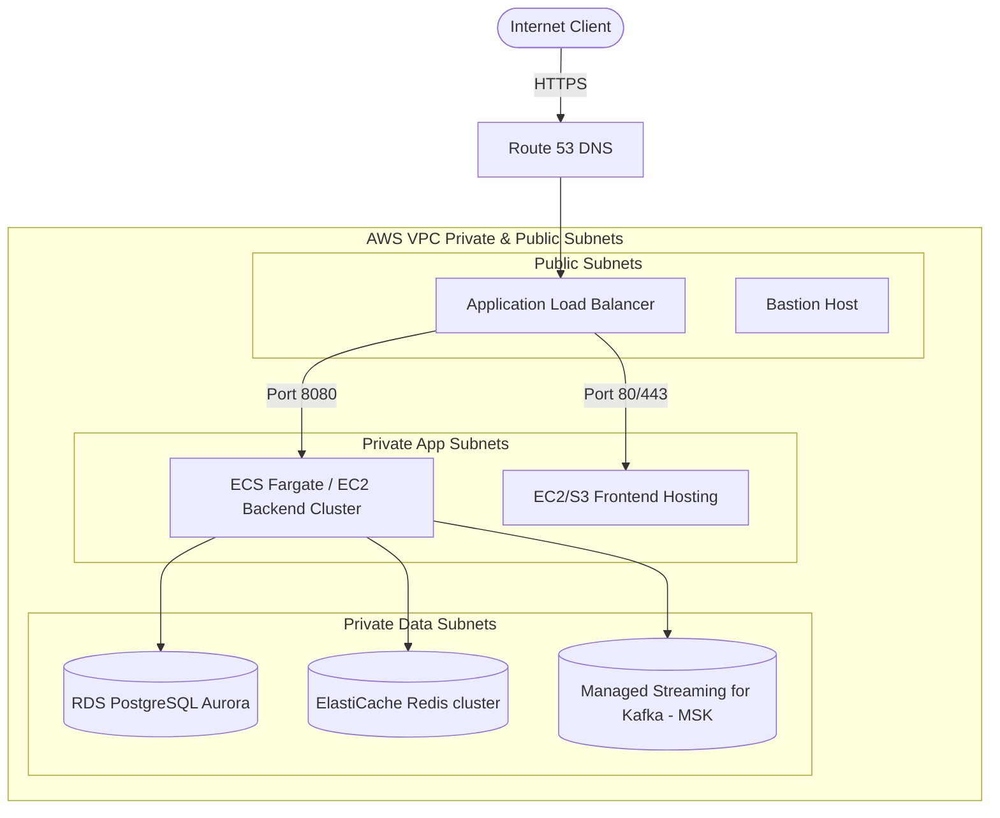

# Deployment Architecture

This document describes the production AWS deployment target alongside local container orchestration details.

## Production AWS Deployment Target

### Components
1. **Route 53 & ALB**: Route user traffic to frontend/backend services, performing TLS termination.
2. **ECS Fargate**: Runs stateless Spring Boot backend Docker instances. Horizontal Auto-scaling is configured based on CPU (target 70%) and request counts.
3. **Aurora Serverless PostgreSQL**: Relational database running in multiple availability zones (Multi-AZ) with read-replicas for low latency and high availability.
4. **ElastiCache Redis**: Key-Value cache mapping short codes to long URLs and storing Rate Limiting token buckets.
5. **MSK (Managed Kafka)**: Durable click event ingestion broker.

## Local Environment Composition

For local development and testing, all components are wrapped into a single `docker-compose.yml` file mapping logical ports:
- **Nginx/Gateway**: Port `80`
- **Frontend App**: Port `5173`
- **Backend App**: Port `8080`
- **PostgreSQL**: Port `5432`
- **Redis**: Port `6379`
- **Kafka**: Port `9092`
- **Prometheus**: Port `9090`
- **Grafana**: Port `3000`
