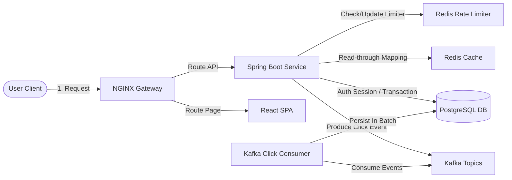
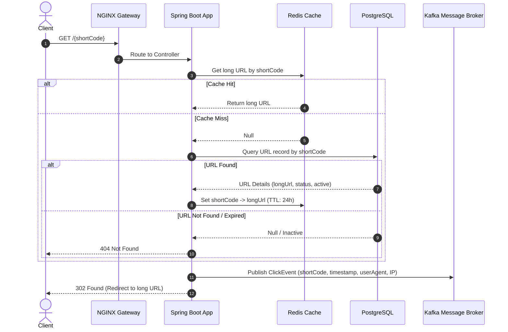

# High Level Design (HLD)

This document describes the high-level design components, interfaces, and request flows.

## Component Architecture

## Core Request Flows

### 1. Read-Through URL Redirection Sequence

### 2. Async Click Analytics Pipeline

To ensure the redirect endpoint completes in under 50ms, writing analytics to the database is decoupled via Kafka:
* **Producer**: Inside the redirect endpoint, a lightweight Kafka producer publishes a `ClickEvent` to the `url-clicks` topic.
* **Consumer**: A background consumer group subscribes to `url-clicks`, aggregates/batches events, and writes them to PostgreSQL to minimize database connection and query overhead.
