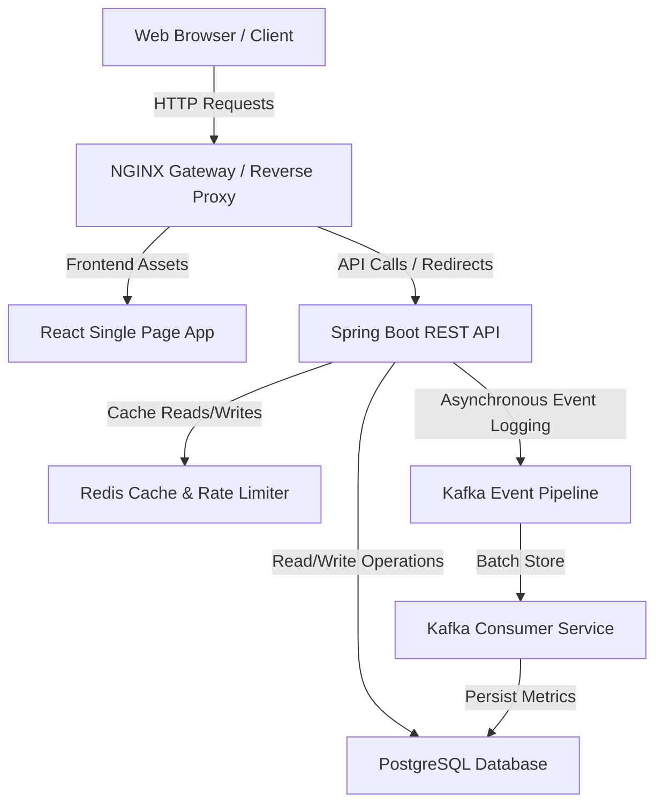

# System Overview

The Distributed URL Shortener is a high-performance system designed to map long URLs to short, unique, and deterministic codes, redirecting users to the original URL with latency under 50ms.

## System Context Diagram

## Service Boundaries

The system is decomposed into the following logical boundaries:
1. **Frontend UI Client**: Handles registration, login, dashboard rendering, URL management, and graphical analytics.
2. **Reverse Proxy (Nginx)**: Serves static assets, routes API requests, and acts as the entry point.
3. **Core API Service**: Handles URL shortening creation, user management/auth, and redirection logic.
4. **Cache & Rate Limit Layer**: Stores active short-code mappings and manages IP-based rate limiting buckets.
5. **Async Tracking Pipeline**: Collects and ingests redirection click data out-of-band to prevent slowing down redirects.
6. **Persistence Layer**: Relational data store for structured data (Users, URLs, Analytics, API Keys).
